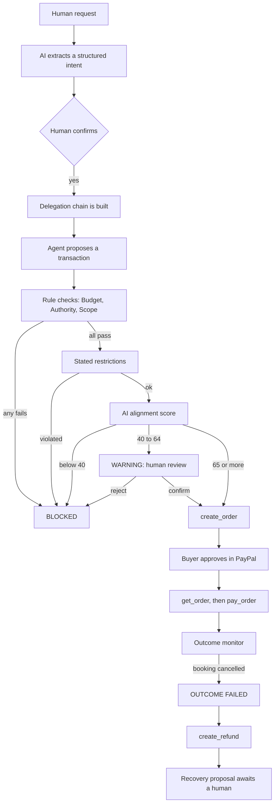
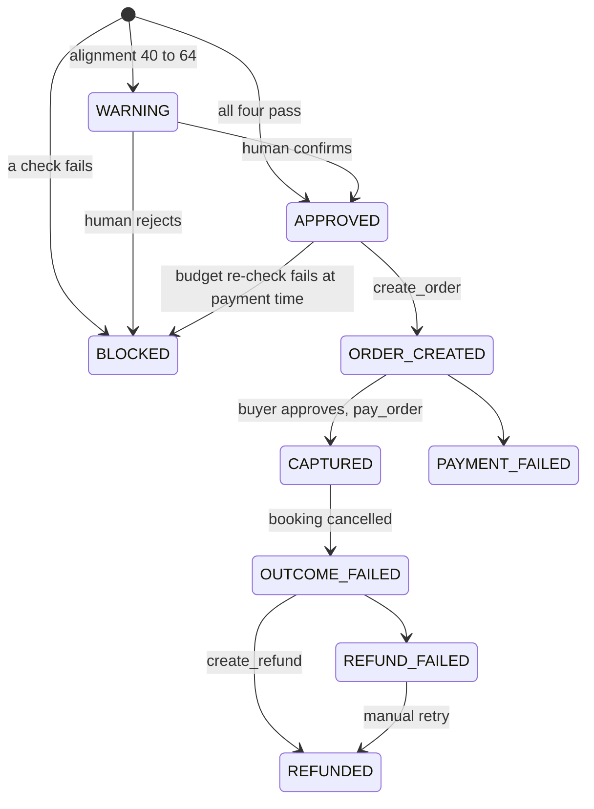

# Architecture

IntentChain is one Node.js process (Next.js, UI and API together) with a SQLite file. The "services"
below are modules inside it.

## Flow



## The four checks

They are deliberately non-overlapping, and all four are shown for every transaction.

| Check | Rule |
|---|---|
| Budget | captured-and-not-refunded total + this amount ≤ intent budget. Blocked transactions consume nothing |
| Authority | amount ≤ the tightest limit anywhere up the agent's delegation chain, including any category cap and per-night cap; the grant must be active and unexpired |
| Scope | where and when only: trip location, trip dates, currency. Never *what* is bought |
| Intent | a purchase in a restricted category fails outright; otherwise the alignment score decides (≥ 65 pass, 40–64 human review, < 40 fail) |

Keeping "what is bought" out of Scope is what lets the Intent check stand alone: the theme park
ticket is in the right city, on the right dates, within the Travel Agent's $600 authority and within
budget. Only its purpose is wrong.

When a rule check fails the AI is not called at all.

## Delegation

```
Human $600
  └─ Travel Agent   $600   lodging ≤ $500, connectivity ≤ $40     tools: create_order, get_order, pay_order
       ├─ Hotel Agent    $500   lodging only, until check-in      tools: none
       │    └─ Booking Agent  $180/night, max $500, 30 min, single use   tools: create_order, get_order, pay_order
       └─ Experience Agent  $150  "improve the overall travel experience"  tools: create_order, get_order, pay_order
Recovery Agent (started by an outcome event)                      tools: get_order, create_refund, get_refund
```

Three mechanisms act on this chain, all in [`src/lib/delegation.ts`](../src/lib/delegation.ts).

**Monotonic rule.** `monotonicViolations()` rejects any grant that exceeds its parent in amount,
per-night rate, location, dates, categories or expiry, and any attempt to re-delegate a single-use
grant. New categories are reported separately as *new capabilities*, so an escalation that leaves
the amount untouched is still caught.

**Signed chain.** A grant's signature is `HMAC(key, session | parent signature | this grant's
limits)`. The root signature is derived from the intent. Before any transaction is evaluated,
`verifyChain()` walks from the agent's grant to the root, re-derives every signature top-down and
re-checks the subset relation. A grant whose limits were edited after signing fails, as does a
grant with no signed parent. A failed chain fails the Authority check.

**Intent fidelity.** `assessFidelity()` rates each grant's stated task against the human intent on
a five-level rubric, scaled to 0–100. Below 65 the grant is marked as drifted. Drift does not
reject the grant — it is structurally valid — but it is recorded, shown on the chain, and used for
attribution: when a purchase made under that grant fails the Intent check, the violation source is
the delegation hop where the drift began, not the last agent in line.

PayPal permissions follow the same shape. Each role has its own PayPal Agent Toolkit instance,
constructed with only that role's `actions`; a call to a tool the role was not granted is refused
before it reaches the toolkit.

## Transaction states



`BLOCKED` is final. Order creation, capture and refund are never retried automatically, so a
network error cannot double-charge or double-refund; capture first reads the order with `get_order`.

## Audit

Every state change appends one event to `audit_events`. The timeline in the UI is that table.
Every event carries the intent id, which is how a transaction is traced back to the human goal.

Dashboard metrics:

| Metric | Definition |
|---|---|
| Intent integrity | amount-weighted mean alignment score of every captured payment |
| Authority integrity | share of captured payments that were inside the paying agent's authority |
| Outcome status | *Recovery Active* once any captured payment has a failed outcome |

## Sessions and data

There are no accounts. Each browser receives a random id in an HttpOnly cookie; every row is keyed
by it, so visitors to the hosted demo cannot see or reset each other's state. Sessions idle for 24
hours are deleted.

Secrets (PayPal credentials, the AI key) live only in the server's `.env`. Calls to the AI are
capped per session and per day; past the cap the app falls back to cached reference scores and says
so in the UI.

## Modes

| | Configured | Not configured |
|---|---|---|
| PayPal | Sandbox orders, captures and refunds through the Agent Toolkit | Simulated ids prefixed `SIM-`, labelled *Simulated* everywhere |
| AI | Live alignment scoring, labelled *AI* | Reference scores, labelled *cached* |

The validator, delegation rules, state machine and audit log are identical in every mode.
